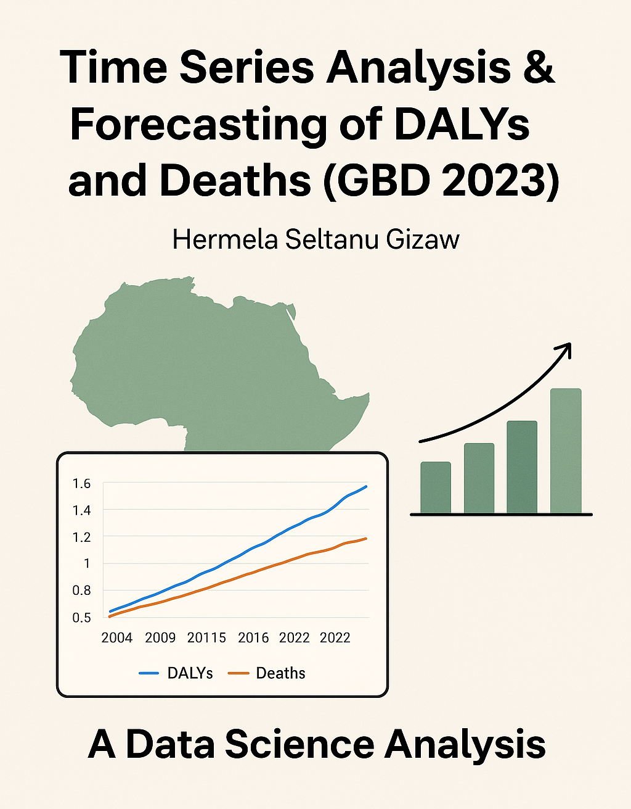

<p align="center">
  
</p>

# African-HealthBurden-Analysis-2003-2023

## 1. Introduction

The aim of this project is to analyze temporal patterns in health outcomes across African countries using the Global Burden of Disease (GBD 2023) dataset. The study focuses on two key population-level measures:
  - DALYs (Disability-Adjusted Life Years)
  - Deaths

The analysis includes country-level aggregation, age-structured analysis, cause-level decomposition, and exploratory modelling to understand long-term trends, relationships between indicators, and potential forecasting applications.

## 2. Data Preparation and Cleaning
### 2.1 Loading and standardizing the main dataset

The main GBD dataset (“IHME-GBD_2023_DATA…csv”) was loaded and inspected. Measure names were standardized to ensure consistency (e.g., mapping "DALYs (Disability-Adjusted Life Years)" → "DALYs").

### 2.2 Pivoting into country-year format

To enable time-series modelling, the dataset was reshaped into a wide format with columns:
  - val_DALYs, val_Deaths
  - upper_DALYs, upper_Deaths
  - lower_DALYs, lower_Deaths

This was achieved using a multi-index pivot: year × location × sex × age × cause × metric.

### 2.3 Aggregation to country totals

To obtain a clean country-level time-series, values were summed across:

  - all sexes
  - all age groups
     all causes

This produced a dataset (simple_df_total) with yearly totals for each country from 2003-2023.

## 3. Country-Level Time Series Patterns
### 3.1 Total deaths over time

A multi-country line chart revealed that:
  - Some countries have steadily increasing deaths over time.
  - Others exhibit declines or oscillations depending on conflict, disease outbreaks, or healthcare improvements.
  - The annual frequency (dtick=1) confirms the dataset is annual - consistent with ARIMA-type modelling.

### 3.2 DALYs time trend

Similarly, DALYs show long-term increasing or decreasing patterns depending on country. These series often contain:
  - monotonic trends
  - structural shifts
  - non-stationary behaviour

Important for forecasting: Both series are clearly non-stationary, meaning differencing is likely required before ARIMA modelling.

### 3.3 Joint relationship: DALYs vs Deaths (2003-2023)

An animated scatter plot shows:
  - Countries move through time together in the DALYs–Deaths space.
  - DALYs and deaths are strongly positively correlated.

### 3.4 Statistical relationship (2016-2023)

For each country, we computed:
  - Pearson correlation (r)
  - Linear regression (DALYs on deaths)
  - Slope (DALYs per additional death)
  - Mean DALYs-per-death ratio
  - R² goodness-of-fit

Most countries showed:

  - Strong positive correlations (indicating deaths are a good predictor of DALYs)
  - High DALYs-per-death ratios, meaning non-fatal burden contributes significantly to DALYs.
  - This establishes a linear baseline before applying more advanced forecasting models.

## 4. Additional Descriptive Analysis
### 4.1 Country example (Nigeria)

A grouped bar chart showed DALYs consistently exceeding deaths by a large margin - consistent with the definition of DALYs (years of life lost + years lived with disability).

### 4.2 Average burden across countries

A comparison of mean DALYs and deaths over the full period identified:

  - Countries with highest long-term disease burden.
  - DALYs ranking does not always match deaths ranking, suggesting differing disability contributions.

## 5. Cause-Level Analysis
### 5.1 Identifying top causes

Using aggregated pivot_df, we computed cause-wise totals and extracted the top 5 causes of death based on mean deaths over time.

### 5.2 Trends for Kenya (example)

A country-specific line chart for Kenya revealed:

  - Which causes dominate mortality risk over time.
  - Temporal shifts in leading causes (e.g., injuries, infections, NCDs).

### 5.3 Latest-year comparison

For the most recent year in the dataset, a grouped bar chart showed:

  - Country differences in DALYs by cause
  - Variation in dominant causes across the continent

This provides insight into cross-sectional variation, useful for contextualizing time-series behaviour.

## 6. Age-Structured Analysis

A second dataset (age + gender) was loaded and aggregated.

### 6.1 Transforming into DALYs and Deaths per age

We created:

  - dalys_age
  - deaths_age
  - and merged them into by_age dataset across year × country × age.

### 6.2 Simplifying age groups

Complex GBD age categories were collapsed into:

  - Neonates
  - Infants
  - Children (1-4)
  - Children (5-14)
  - Youth (15-24)
  - Adults (25-54)
  - Older Adults (55-69)
  - Elderly (70+)

This enabled interpretable age-group analysis.

### 6.3 Age composition of DALYs (stacked bar chart)

A 100% stacked chart across all African countries showed:

- Youth and adults contribute the largest share of DALYs.
- Over time, elderly contribution increases, suggesting demographic transition.

### 6.4 Extra age-focused visuals

Several additional analyses demonstrate the temporal structure:

- Facet line charts of deaths for age 15-19
- Ranking charts for DALYs in age 25-29
- Heatmaps for DALYs <5 years
- Bar charts by age group for the latest year

These add depth to the time-series interpretation, showing heterogeneity by age.

## 7. Relevance to Time Series Analysis & Forecasting

Although forecasting code comes later (e.g., ARIMA), the steps above are essential time-series preprocessing:

✔ Stationarity Evaluation

Trends in DALYs and deaths indicate clear non-stationarity, requiring differencing.

✔ Relationship with Explanatory Variables

The DALYs–Deaths linear modelling gives intuition for multivariate forecasting (VAR, regression with ARIMA errors, etc.).

✔ Temporal Aggregation & Smoothing

All data were aggregated to yearly frequency, yielding clean univariate time series per country.

✔ Seasonality

None is expected due to annual data; ARIMA without seasonal terms is appropriate.

✔ Structural Breaks

Many countries show breaks (e.g., post-2015), suggesting:

  - ARIMA with drift
  - Piecewise regression
  - State-space models could be explored.

## 8. Conclusion

This analysis created a comprehensive time-series-ready dataset from complex GBD health data. Trends in DALYs and deaths were explored visually and statistically. Age structure, causes of death, and country-level differences were analyzed to contextualize burden patterns across Africa.

The cleaned country time series (2003-2023) are now suitable for forecasting using ARIMA, Random Forest, XGBoost, or other time-series models. in readme format u know kinda like this 
## 9. Install Dependencies
```bash
pip install -r requirements.txt
```

## 10. License & Citation

This project is released under the MIT License: see LICENSE. If you reuse outputs, please cite IHME GBD 2023 as the original data source.

## Contact / acknowledgements
Author: Hermela S. Gizaw

Email: hermelaselt@gmail.com
